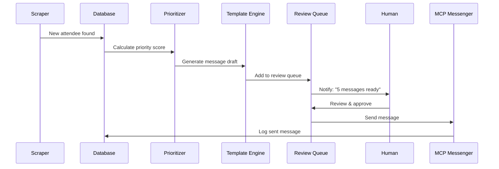
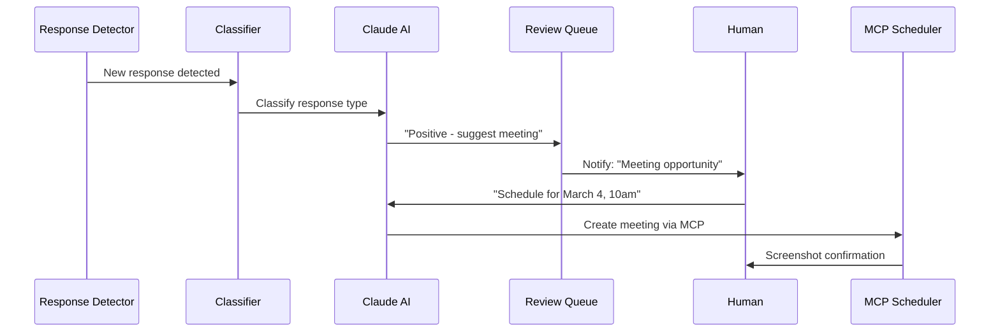

# MWC Barcelona Messaging System - Ideation Document

A comprehensive ideation on architecting an intelligent attendee outreach and messaging system for MWC Barcelona 2026.

---

## Vision Statement

> Build an intelligent, semi-automated system that identifies high-value MWC Barcelona attendees, prioritizes outreach based on relevance, and facilitates personalized engagement at scale while maintaining authenticity.

---

## Part 1: Problem Analysis

### Current Pain Points

| Pain Point | Impact |
|------------|--------|
| **Manual Discovery** | Hours spent browsing attendee lists |
| **No Prioritization** | Can't identify best-fit contacts |
| **Repetitive Messaging** | Copy-pasting similar messages |
| **Tracking Gaps** | Losing track of who was contacted |
| **Timing Issues** | Missing optimal outreach windows |
| **Response Management** | Difficulty tracking conversations |

### Opportunity

MWC Barcelona has 100,000+ attendees. Finding and engaging the right people efficiently could mean:
- 10x more relevant connections
- Higher response rates through personalization
- Better meeting scheduling success
- Optimized conference time

---

## Part 2: System Components

### Component Architecture

```
┌─────────────────────────────────────────────────────────────────────┐
│                    MWC OUTREACH AUTOMATION SYSTEM                    │
├─────────────────────────────────────────────────────────────────────┤
│                                                                      │
│  ┌─────────────┐   ┌─────────────┐   ┌─────────────┐                │
│  │  DISCOVERY  │ → │ ENRICHMENT  │ → │PRIORITIZATION│               │
│  │   Module    │   │   Module    │   │   Module     │               │
│  └─────────────┘   └─────────────┘   └─────────────┘                │
│         │                │                  │                        │
│         ▼                ▼                  ▼                        │
│  ┌─────────────────────────────────────────────────────┐            │
│  │              ATTENDEE DATABASE (SQLite)              │            │
│  │  uuid | name | company | title | country | score    │            │
│  └─────────────────────────────────────────────────────┘            │
│         │                                                            │
│         ▼                                                            │
│  ┌─────────────┐   ┌─────────────┐   ┌─────────────┐                │
│  │  MESSAGING  │ ← │  TEMPLATE   │ ← │   CAMPAIGN   │               │
│  │   Engine    │   │   Engine    │   │   Manager    │               │
│  └─────────────┘   └─────────────┘   └─────────────┘                │
│         │                                                            │
│         ▼                                                            │
│  ┌─────────────┐   ┌─────────────┐   ┌─────────────┐                │
│  │  RESPONSE   │ → │  MEETING    │ → │  ANALYTICS  │                │
│  │  Tracker    │   │  Scheduler  │   │  Dashboard  │                │
│  └─────────────┘   └─────────────┘   └─────────────┘                │
│                                                                      │
└─────────────────────────────────────────────────────────────────────┘
```

---

## Part 3: Module Deep Dive

### Module 1: Discovery Engine

**Purpose:** Continuously scan and capture new attendee registrations.

**Approach Options:**

| Option | Method | Pros | Cons |
|--------|--------|------|------|
| **A. API Polling** | Direct API calls with filters | Fast, structured data | Token management |
| **B. MCP Browser** | Chrome DevTools MCP | Session persistence | Requires Chrome open |
| **C. Hybrid** | MCP for auth, API for data | Best of both | More complex |

**Recommended: Option C (Hybrid)**

```
Flow:
1. MCP connects to authenticated Chrome session
2. MCP captures network requests to extract fresh JWT
3. Backend uses JWT for direct API calls
4. MCP periodically refreshes token before expiry
```

**Filter Strategy:**

```yaml
regions:
  tier_1_priority:
    - United States (932)
    - Israel (811)
    - United Kingdom (777)
    - Germany (757)

  tier_2_secondary:
    - France (775)
    - Spain (768)
    - Netherlands (837)
    - Canada (738)

  tier_3_opportunistic:
    - All other European countries

schedule:
  tier_1: every 30 minutes
  tier_2: every 2 hours
  tier_3: daily
```

---

### Module 2: Enrichment Engine

**Purpose:** Enhance attendee data with additional context.

**Data Sources:**

| Source | Data | Method |
|--------|------|--------|
| **MWC Profile** | Full bio, interests, events | Click profile, extract |
| **LinkedIn** | Work history, connections | Manual or API |
| **Company Website** | Company size, focus areas | Web scrape |
| **Crunchbase** | Funding, investors | API |

**Enrichment Workflow:**

```
1. New attendee detected
2. Fetch full MWC profile (via profile URL)
3. Extract:
   - Bio/description
   - Listed interests
   - Company description
   - Event badges (which MWC events)
4. Optional: LinkedIn enrichment
5. Store enriched data
```

**MCP Implementation:**

```
Claude: "Navigate to attendee profile {uuid}, extract their full bio,
company description, and listed interests, then save to database"

Tools: navigate_page → evaluate_script → [database write]
```

---

### Module 3: Prioritization Engine

**Purpose:** Score and rank attendees by relevance and likelihood to engage.

**Scoring Model:**

```python
def calculate_priority_score(attendee):
    score = 0

    # Title scoring (0-30 points)
    title_scores = {
        "C-Level": 30,      # CEO, CTO, CFO, CMO
        "VP": 25,           # Vice President
        "Director": 20,     # Director, Head of
        "Manager": 15,      # Manager
        "Founder": 30,      # Startup founder
        "Other": 5
    }
    score += title_scores.get(categorize_title(attendee.job_title), 5)

    # Company relevance (0-25 points)
    if matches_target_industry(attendee.company):
        score += 25
    elif partially_relevant(attendee.company):
        score += 15

    # Interest alignment (0-20 points)
    matching_interests = count_matching_interests(attendee.interests)
    score += min(matching_interests * 5, 20)

    # Geographic priority (0-15 points)
    geo_scores = {"US": 15, "Israel": 15, "UK": 12, "Germany": 10, "Other EU": 8}
    score += geo_scores.get(attendee.country, 5)

    # Recency bonus (0-10 points)
    if registered_within_days(attendee, 7):
        score += 10
    elif registered_within_days(attendee, 30):
        score += 5

    return score  # Max: 100
```

**Priority Tiers:**

| Tier | Score Range | Action |
|------|-------------|--------|
| **Hot** | 80-100 | Immediate outreach, personalized |
| **Warm** | 60-79 | Same-day outreach, semi-personalized |
| **Cool** | 40-59 | Batch outreach, template |
| **Cold** | <40 | Low priority, maybe skip |

---

### Module 4: Template Engine

**Purpose:** Generate personalized message templates.

**Template Structure:**

```yaml
templates:
  initial_outreach:
    hot_tier:
      name: "VIP Personal"
      variables: [name, company, title, shared_interest, specific_hook]
      template: |
        Hi {name},

        I noticed you're {title} at {company} - {specific_hook}.

        I'm heading to MWC Barcelona and would love to connect about
        {shared_interest}. We're working on [your value prop].

        Would you have 15 minutes for a quick coffee at the event?

        Best,
        [Your name]

    warm_tier:
      name: "Semi-Personal"
      variables: [name, company, shared_interest]
      template: |
        Hi {name},

        Looking forward to MWC Barcelona! I see you're with {company} -
        I'd love to connect about {shared_interest}.

        Let me know if you're open to a brief meeting at the event.

        Cheers,
        [Your name]

    cool_tier:
      name: "Batch Template"
      variables: [name]
      template: |
        Hi {name},

        Will you be at MWC Barcelona? Would be great to connect.

        Best,
        [Your name]

  follow_up:
    no_response_3_days:
      template: |
        Hi {name},

        Just following up on my earlier message. I'll be at MWC
        March 3-6 - would be great to meet up if you're available.

        Let me know!

        [Your name]
```

**AI Personalization:**

```
Claude: "Generate a personalized outreach message for {attendee_name},
who is {title} at {company}. They listed interests in {interests}.
Use our value prop about [X]. Make it conversational, not salesy."
```

---

### Module 5: Messaging Engine

**Purpose:** Execute message delivery via MWC platform.

**Workflow Options:**

#### Option A: Fully Automated (Risky)

```
[Not Recommended]
- Auto-sends all messages without review
- Risk: Spam, errors, platform ban
```

#### Option B: Human-in-the-Loop (Recommended)

```
Flow:
1. System generates message draft
2. Human reviews/edits in queue
3. Human clicks "Approve"
4. System sends via MCP
5. System logs sent message
```

#### Option C: Batch Review + Auto-Send

```
Flow:
1. System generates 10 message drafts
2. Human reviews batch, edits as needed
3. Human approves batch
4. System sends with 30-60 second delays
5. System logs all messages
```

**MCP Messaging Implementation:**

```
Claude: "Send this message to attendee {uuid}:

'{message_text}'

Wait for confirmation that message was sent, then take a screenshot."

MCP Tools:
1. navigate_page → /mymwc/messaging?conversation={uuid}
2. wait_for → input[placeholder="Type a message..."]
3. fill → Enter message text
4. click → Send button
5. wait_for → Message bubble appears
6. take_screenshot → Confirmation
```

**Rate Limiting:**

```yaml
rate_limits:
  messages_per_hour: 20
  messages_per_day: 100
  delay_between_messages: 30-90 seconds (randomized)
  cool_down_after_batch: 5 minutes
```

---

### Module 6: Response Tracker

**Purpose:** Monitor and categorize responses.

**Response Detection:**

```
Option A: Periodic Polling
- Check messaging page every 5 minutes
- Compare message count with stored count
- Flag new messages

Option B: MCP Network Monitoring
- Monitor SendBird WebSocket traffic
- Detect new message events
- More real-time but complex
```

**Response Categories:**

| Category | Detection | Action |
|----------|-----------|--------|
| **Positive** | "yes", "sure", "let's meet" | → Meeting scheduler |
| **Interested** | "tell me more", "what do you do" | → Queue follow-up |
| **Negative** | "not interested", "no thanks" | → Mark closed |
| **Deferred** | "busy right now", "maybe later" | → Schedule reminder |
| **No Response** | 72+ hours, no reply | → Queue follow-up |

---

### Module 7: Meeting Scheduler

**Purpose:** Automate meeting setup for positive responses.

**Workflow:**

```
1. Response classified as "Positive"
2. AI drafts meeting proposal:
   - Suggests 2-3 time slots
   - Proposes meeting location (your booth, coffee area, etc.)
3. Human reviews/approves
4. System sends via MCP messaging
5. If accepted → Create MWC meeting via MCP
```

**MCP Meeting Creation:**

```
Claude: "Schedule a meeting with {attendee_uuid}:
- Date: March 4, 2026
- Time: 10:00 - 10:30
- Subject: Quick intro - {company} x [Your Company]
- Location: Hall 2, Stand 2B45
- Description: Looking forward to discussing {topic}"

MCP Tools:
1. navigate_page → messaging page
2. click → Create Meeting button
3. wait_for → Modal appears
4. fill_form → All meeting details
5. click → Save
6. take_screenshot → Confirmation
```

---

### Module 8: Analytics Dashboard

**Purpose:** Track outreach effectiveness and optimize.

**Key Metrics:**

| Metric | Formula | Target |
|--------|---------|--------|
| **Response Rate** | Responses / Messages Sent | >25% |
| **Positive Rate** | Positive / Total Responses | >40% |
| **Meeting Rate** | Meetings / Positive Responses | >60% |
| **Conversion** | Meetings / Messages Sent | >6% |

**Dashboard Views:**

```
Daily Summary:
- New attendees discovered: 47
- Messages sent: 23
- Responses received: 8
- Meetings scheduled: 3

By Country:
- US: 12 sent, 5 responses (42%)
- UK: 6 sent, 2 responses (33%)
- Germany: 5 sent, 1 response (20%)

By Priority Tier:
- Hot: 5 sent, 4 responses (80%)
- Warm: 10 sent, 3 responses (30%)
- Cool: 8 sent, 1 response (12%)
```

---

## Part 4: Implementation Phases

### Phase 1: Foundation (Week 1)

```
Tasks:
□ Set up SQLite database schema
□ Install Chrome DevTools MCP
□ Test MCP connection to authenticated session
□ Implement basic attendee discovery (1 country)
□ Store attendees in database

Deliverable: Working scraper for US attendees
```

### Phase 2: Scale Discovery (Week 2)

```
Tasks:
□ Add all target countries
□ Implement pagination (get ALL attendees)
□ Add duplicate detection
□ Create daily scraping schedule
□ Implement enrichment (full profile fetch)

Deliverable: Complete attendee database with enrichment
```

### Phase 3: Prioritization & Templates (Week 3)

```
Tasks:
□ Build scoring algorithm
□ Create priority tiers
□ Design message templates
□ Build template personalization
□ Create message queue system

Deliverable: Prioritized list with draft messages
```

### Phase 4: Messaging Automation (Week 4)

```
Tasks:
□ Build MCP messaging workflow
□ Implement human review queue
□ Add rate limiting
□ Create sent message logging
□ Build response detection

Deliverable: Working messaging system with tracking
```

### Phase 5: Meeting & Analytics (Week 5)

```
Tasks:
□ Build meeting scheduler integration
□ Create analytics dashboard
□ Add response categorization
□ Implement follow-up automation
□ Performance optimization

Deliverable: Complete end-to-end system
```

---

## Part 5: Technical Decisions

### Decision 1: Storage

| Option | Pros | Cons | Verdict |
|--------|------|------|---------|
| SQLite | Simple, local, fast | Not distributed | **Selected** |
| PostgreSQL | Scalable, robust | Overkill | No |
| Google Sheets | Visual, shareable | Slow, rate limits | Optional export |

### Decision 2: Messaging Approach

| Option | Pros | Cons | Verdict |
|--------|------|------|---------|
| Direct API | Fast | Complex auth | No |
| Playwright | Reliable | Cookie management | No |
| Chrome MCP | Session reuse | Needs Chrome open | **Selected** |

### Decision 3: Human-in-the-Loop

| Option | Pros | Cons | Verdict |
|--------|------|------|---------|
| Full Auto | Fast | Risky, impersonal | No |
| Review Each | Safe | Slow | For Hot tier |
| Batch Review | Balanced | Some risk | **Selected** for Warm/Cool |

### Decision 4: Scheduling

| Option | Pros | Cons | Verdict |
|--------|------|------|---------|
| Cron | Simple | System must be on | For scraping |
| Manual Trigger | Control | Requires attention | For messaging |
| Event-Driven | Responsive | Complex | Future |

---

## Part 6: Risk Mitigation

| Risk | Impact | Mitigation |
|------|--------|------------|
| **Platform Ban** | High | Rate limiting, human review, natural delays |
| **Token Expiry** | Medium | MCP auto-refreshes via session |
| **Wrong Messages** | High | Human review before send |
| **Missed Responses** | Medium | Regular polling, notifications |
| **Data Loss** | High | Regular database backups |
| **Selector Changes** | Medium | MCP adapts; fallback to AI interpretation |

---

## Part 7: Success Criteria

### Must Have (MVP)

- [ ] Discover new attendees from target countries
- [ ] Store attendees with deduplication
- [ ] Send messages via MCP
- [ ] Track sent messages
- [ ] Detect responses

### Should Have

- [ ] Priority scoring
- [ ] Message templates
- [ ] Human review queue
- [ ] Meeting scheduling
- [ ] Basic analytics

### Nice to Have

- [ ] LinkedIn enrichment
- [ ] AI-generated personalization
- [ ] Response auto-categorization
- [ ] Advanced analytics
- [ ] Mobile notifications

---

## Part 8: Open Questions

1. **Message Tone**: Formal or casual? Industry-specific?
2. **Meeting Slots**: How many time slots available per day?
3. **Team Collaboration**: Will others use the system?
4. **Integration**: Connect to CRM (HubSpot, Salesforce)?
5. **Follow-up Cadence**: How aggressive on follow-ups?

---

## Appendix: Sample Workflows

### Workflow A: New Attendee → Message



### Workflow B: Response → Meeting



---

*Last updated: 2026-02-05*
